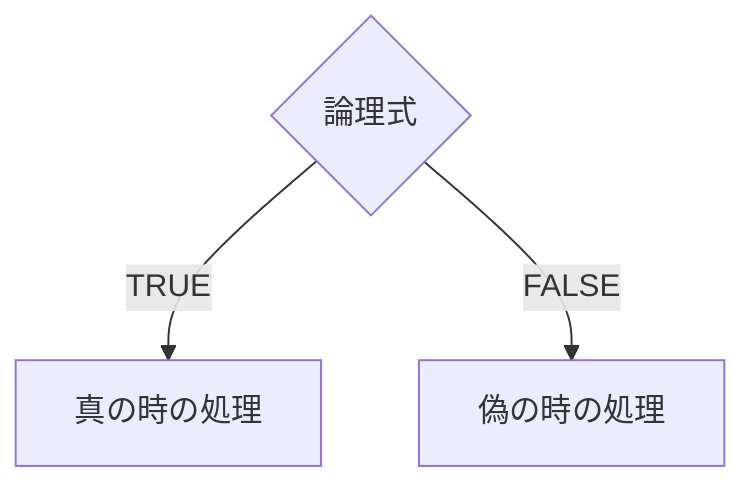
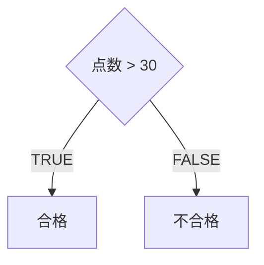

# はじめに

今回も、実際に表計算ソフト使って見ましょう。
この連載では、google spreadsheetを使っていきます。
excelを利用したいという人も基本的に、操作は似ているので参考にできると思います。
ちなみに、使用するブラウザはchromeを想定しています。

今回は、計算式や関数を使って計算を行います。。
初めに、簡単な四則演算の説明をし、
次に関数を使った計算及び処理について説明します。

# まず計算をさせてみよう

表計算ソフトのほとんどは、数学で扱うような計算式を書くことで、計算をさせることが出来ます。
ルールとしては、イコールから書き始めることくらいです。

また、計算に使用する演算子も、日頃使っているものと違う部分があるので注意してください。
演算子とは、計算の際に書く「＋, ー, ×, ÷」といった記号のことです。

|演算名|表計算ソフトで使用する演算子|
|----|:--:|
|加算|+|
|減算|-|
|乗算|*|
|除算|/|
|べき乗|^|
|余り|%|

実際に使うとこんな感じです。
通常の計算で使用する計算式とほとんど変わらないですね。

また、計算式入力の際にセルをクリックすることで、そのセルに入力されている値を参照することも出来ます。
これは、値を書き換えた時に自動的に計算もやり直してくれるので便利です。

## 相対参照

計算の際にセルを参照をすると、その式をコピーして別の場所に貼り付けた際に、参照場所もそれに合わせて移動した分だけ移動してくれます。

これによって同じ計算の場合は、いちいち計算式を書く必要がなく、コピペだけで済ませることが出来ます。

これは、計算式を移動させたことで、相対的に参照場所も移動する参照なので、 **相対参照** と言われます。

## 絶対参照

一方で、このように参照場所が動いてほしくない時もあります。

そのときは、参照するセルのセル番地に$(ドルマーク)をつけます。
列方向を固定したいときは、アルファベットに、行方向を固定したいときは、数値の前にドルマークをつけます。
両方固定したい場合は、両方につけます。

このように、計算式を移動させても、参照場所は絶対位置で動かない参照のことを **絶対参照** と言います。

相対参照と絶対参照は、うまく使うと効率的に表を作ることが出来ます。

# 関数とは

ここからは、関数について見ていきましょう。
ここまでに紹介した計算式は、合計や平均など複雑な計算をさせようと思うと、式が長く繁雑になってしまいます。

そこで登場するのが関数です。

関数は、合計や平均など、何かしらの機能を簡単に書くための仕組みです。

関数は、関数名と引数を指定することで、さまざまな処理を行わせることが出来ます。

関数名で、合計を求めるのか、平均を求めるのか、はたまた、30点以上の生徒の人数を求めるのか、といった行いたい処理を指定します。

引数では、その処理に必要な値を指定します。例えば、合計を求めたい場合は、合計を求めるための値がどこに入力されているかを指定する必要があります。
その時に使うのが引数です。
必要な引数の数は、関数によって異なります。

関数の書き方は、このようになります。
計算式と同様にイコールから始めて、関数名、括弧して中に必要な分だけ引数を書きます。

```xlsx:関数の例
=関数名(引数1, 引数2, ...)
```

関数の形はイメージがついたと思いますので、残りは実際の関数を書いて理解を深めていきましょう。

# 関数を使ってみよう

## SUM関数

SUM関数は合計を求める関数で、このように書きます。

```xlsx:SUM関数
=SUM(範囲)
```

`範囲`には、合計を求める範囲のセル番地を入力します。
実際の例だと、このように書きます。

## AVERAGE関数

AVERAGE関数は平均を求める関数で、このように書きます。

```xlsx:AVERAGE関数
=AVERAGE(範囲)
```

`範囲`には、平均を求める範囲のセル番地を入力します。
実際の例だと、このように書きます。

## COUNT関数

COUNT関数は数値が入力されているセルの数を求める関数で、このように書きます。

```xlsx:COUNT関数
=COUNT(範囲)
```

`範囲`には、数値が入力されているセルの数を求める範囲の、セル番地を入力します。

アンケートでの未回答者の数や、試験を受けた生徒の数を求める際に利用します。
実際の例だと、このように書きます。

## MID関数

MID関数は文字列のa番目の文字からb文字分を取り出す関数で、このように書きます。

```xlsx:MID関数
=MID(文字列, a, b)
```

`文字列`にはセル番地を指定しても構いません。

実際の例だと、このように書きます。この例だと、３文字目から２文字分を取り出しています。

## IF関数

IF関数は、少し複雑です。

英語で`If xxx, yyy.`という「もしxxxだったら、yyyなのに。」という文を習ったと思います。

それと同じで、IF関数は、条件が成り立てばこれ、そうでなければこれ、といったふうに処理を分けることができる関数で、このように書きます。

```xlsx:IF関数
=IF(論理式, 真の時の処理, 偽の時の処理)
```

論理式とは、計算結果が正しい(TRUE)か正しくない(FALSE)のみの式です。
例えば、論理式には、`点数 < 30`があります。これは`点数=25`のときは、正しい(TRUE)。
しかし、`点数=87`のときは正しくない(FALSE)。
そして、これ正しい、または、正しくないのどちらかにしたなりません。
このようなものが論理式になります。



論理式は、次のようなものがあります。

|論理式|意味|
|----|----|
|A > B|AはBよりも大きい|
|A >= B|AはB以上|
|A < B|AはBよりも小さい|
|A <= B|AはB以下|
|A = B|AはBと等しい|
|A <> B|AとBは等しくない|

A, Bにはセル番地が入ったり、直接的な値が入ったりします。

そして、この論理式がTRUEのとき、真の時の処理が実行されます。
真の時の処理とは、具体的に表示したい値や、計算させたい関数などを書きます。

論理式がFALSEのとき、偽の時の処理が実行されます。
偽の時の処理も同様に、具体的に表示したい値や、計算させたい関数などを書きます。

実際の例だと、このように書きます。
この例だと、参照したセル番地にある点数が30点以上ならば合格、そうでないならば不合格と表示しています。



## VLOOKUP関数

VLOOKUP関数も複雑です。が使い所が多く、便利な関数なので紹介します。

たいていの表の場合、列方向にそれぞれの項目があり、行方向にそれぞれのデータが入力されています。

|生徒名|国語|数学|英語|合計|
|----|----|----|----|----|
|A|56|87|62|205|
|B|92|43|80|175|
|C|23|45|40|108|

これらのデータから、お目当てのデータを探す時に、何行目のデータか、と縦方向(Vertical)に探していきます。
この縦方向にデータを探す関数がVLOOKUP関数です。

```xlsx:VLOOKUP関数
=VLOOKUP(検索キー, 範囲, 指数, [並べ替え済み])
```

- 検索キーには、検索する値が入ります。例えば、Bさんを見つけたい場合は、Bが入ります。
- 範囲は、探すデータを含むセル番地の範囲が入ります。
- 指数には、値を返す列が入ります。数学の点数を返して欲しければ、範囲の中で３列目なので、3を入力します。
- 並べ替え済みは、わかりにくいですが、TRUEかFALSEを指定します。TRUEを指定した場合、検索キーに近い値のデータを取得します。FALSEに指定した場合は、検査キーと完全に一致した値を取得します。この引数は省略することができ、その場合は、TRUEが指定されます。基本的にはFALSEを指定した方がいいでしょう。

引数に指定する要素が多いので、例を見て理解を深めましょう。


## 関数の組み合わせ

関数は、組み合わせることで、より複雑な処理をさせることも出来ます。

ここでは、次のような例をもとに、IF関数とSUM関数を組み合わせた例を紹介します。

この例では、以前とったイベントの希望調査の表の例を使いましょう。
どのイベントを希望するかの調査を昔表にまとめていたが、最近になって、調査し直したら希望しない人が出てきたシチュエーションです。
このような場合、最終希望に◯が付いている人だけ、合計支払い金額を求め、それ以外の人は、空欄になるような処理が必要になります。
それを、関数を使って実現しましょう。


ここで見せたのは、一例です。このように引数に、関数を書くこともできるので、発想次第で、色々な処理をさせることが出来ます。
ただし、組み合わせ過ぎると、後から見直した時に、何を書いているかわからない可読性の低いものになってしまいます。

関数の組み合わせはほどほどに、表を作成する段階で、関数の組み合わせがいらないような設計をしましょう。

# 関数の調べ方

ここまでに、いくつか関数を紹介してきましたが、実際にはもっと多くの関数が存在します。

Excelではバージョンなどにもよりますが、400以上の関数があります。

Google spreadsheetは、具体的な数が書いてある記事を見つけることはできませんでしたが、[Google スプレッドシートの関数リスト](https://support.google.com/docs/table/25273?hl=ja)に一覧が載っていて、これだけでもたくさんあるのがわかります。

これらを全て説明するのは、難しいですし、そもそも必要な関数だけをその都度調べて、使えるようにしておけば、問題ありません。

そこで、関数の調べかたを最後に紹介します。関数の調べかたをマスターすると、おおよそ思いつくことの、ほとんどはできるようになるかと思います。

## 表計算ソフト上で調べる

表計算ソフトでは、関数を機能の種類ごとに一覧にしてあるので、そこから自分のやりたいことを探すことが出来ます。

### google spreadsheetの場合

メニューバーのΣ(シグマ)から関数の一覧を表示できます。その中から、使いたいものを選ぶだけで関数が入力されます。
入力された段階で説明が表示されるので、その説明を読むことで、どのような関数なのか理解することが出来ます。

###  Excelの場合

左上あたりの$fx$と表記されたところをクリックすると右側にサイドバーガ表示され、関数の一覧が表示されます。
関数をクリックすると説明が表示されるので、その説明を読むことで、どのような関数なのか理解することが出来ます。

また、関数を挿入をクリックすることで、選択中のセルに関数を挿入することが出来ます。

## ウェブの検索を使用する

関数について、説明しているサイトもたくさんあるので、googleなどの検索エンジンを使うのも良い方法です。
`excel 検索 関数`というキーワードだけでVLOOKUP関数を検索することができるので、やりたいことが漠然としている時には、便利です。

# まとめ

今回は、google spreadsheetを通して表計算ソフトの使い方の基本を学んできました。
たくさん紹介したので、この動画を見直して復習してみてください。

前回も言いましたが、このようなソフトは「習うより慣れろ」です。
説明を聞くより、いろいろ操作してみた方が、使いこなせるようになります。
それに、この動画だけでは、全ての機能を紹介することはできません。
いろいろ触って操作してみて、学びを深めていってほしいです。