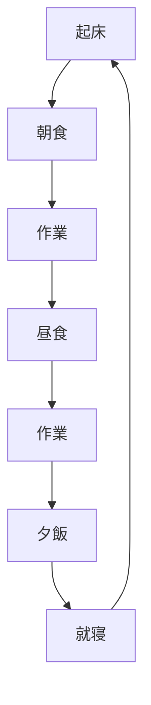

# 使い方

`./mkarticle.sh ファイル名`でマークダウンファイルを作成(ファイル名は必ず入れる)

初めての場合は、`chmod 755 mkarticle.sh`をする

- title
- category
- topics
- published

を入力する。

以降に記事を書いていく。

## title
記事のタイトル(必須)

## category
記事のカテゴリー（必須）

現在検討中

そもそもtopicsで検索可能にする予定なので必要ないかもしれない。ユーザーが記事を見つけやすい方を最終的には残す。
そのため、現在は必須

## topics
検索用のタグ。配列で複数指定可能

## published
本番環境では、trueのものを表示する

# ヘッダー

# ヘッダー1
## ヘッダー2
### ヘッダー3
#### ヘッダー4
##### ヘッダー5

# リスト

- テキスト
- テキスト
- テキスト
- テキスト

1. テキスト
2. テキスト
3. テキスト
4. テキスト

# インライン

`テキスト`

# コード

```py:main.py
import time

print(time)
```

# リンク

[Zenn｜エンジニアのための情報共有コミュニティ](https://zenn.dev/)

https://zenn.dev/

https://youtu.be/2r2ec_sAlGs

https://note.com/france_go_/n/n8ac5b8942995

https://photoshopvip.net/133583

# 画像


## 通常の画像


# 引用
> テキスト
>> テキスト

# 注釈

テキスト[^1]

[^1]: 注釈内容

# テーブル

| th左 | th中央 | th右 |
| :-- | :-: | --: |
| td | td | td |

# 文字装飾

**テキスト**

*テキスト*

~~テキスト~~

***

# フローチャート

